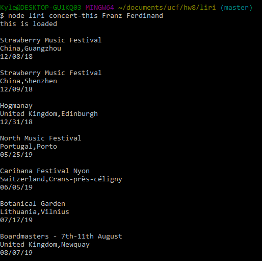
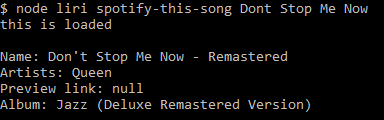
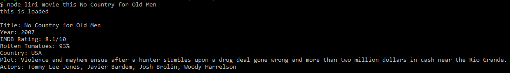
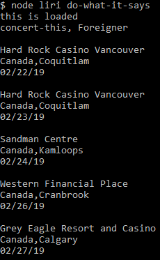
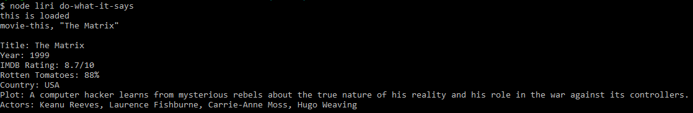
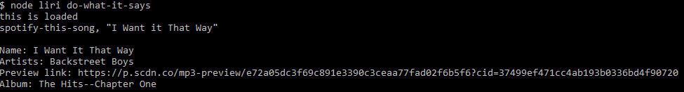

# LIRI
Language Interpretation and Recognition Interface
LIRI uses three different APIs, using axios to search either the bandsintown API(concert-this) or OMDB API(movie-this) to search concerts or movies,or using the Spotify API(spotify-this-song) to search music.
It's also possible to run a random search from any of the APIs using the do-what-it-says function.
To use, the first argument after node liri should be one of the above functions, and for the first three the remaining arguments are the search terms.
Concert-this returns the first 5 upcoming concerts(if there are any) with their name, location, and date.
Spotify-this-song returns the name of the song, the artists that performed the song, a link to a 30 second preview of the song on Spotify, if there is one, and the name of the album the song is on.
Movie-this returns the title, year, IMDB rating, Rotten Tomatoes score, production country, plot summary, and the main actors.

This is the output when you use the concert-this function.

This is the output when you use the spotify-this-song function.

This is the output when you use the movie-this function.

These are all possible outputs for the do-what-it-says function.
There are nine possibilities, three for each of the concert, spotify, and movie functions.

